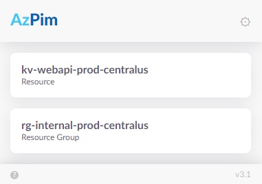
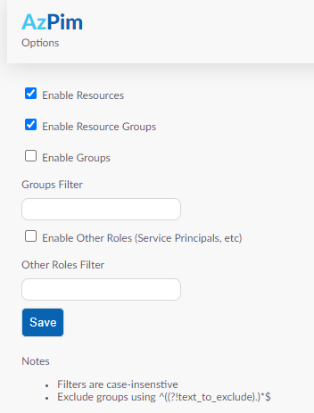

# azPim 

_PIM like a madman_

Easy access to Privileged Identity Management (PIM) in Azure.

When viewing an Azure Resource, launch the azPim extention to get quick links to the associated PIM resources.

## NOTE

_This project is NOT affiliated with Microsoft.  Use at your own risk._

## Installation Instructions

### Google Chrome / Microsoft Edge

* Download this repo
* In Chrome/Edge go to the extensions page (chrome://extensions or edge://extensions).
* Enable Developer Mode.
* Press the `Load Unpacked` button
* From the previously downloaded folder, select the `src` folder

_NOTE Once the extension is loaded, you cannot delete the folder_

### Firefox

_Not yet supported_